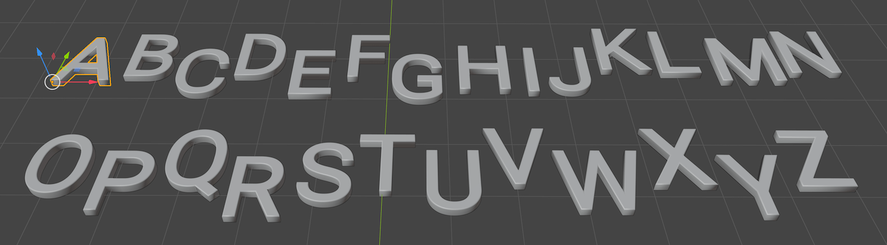
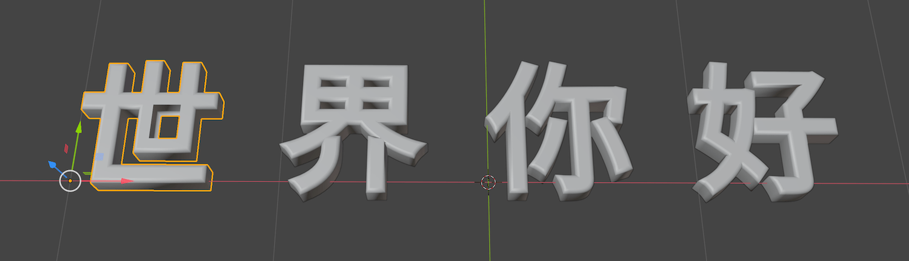

# font-to-3d-models

A Blender script to auto generate 3D models for alphabet letters or Unicode
glyphs based on a TTF/OTF font file.

## Prerequisites

[Blender](https://www.blender.org/) is installed, and [the command line
interface of
Blender](https://docs.blender.org/manual/en/latest/advanced/command_line/index.html)
is executable.

## Usage

```shell
usage: [Blender executable] -b -P font_to_3d_models.py -- [-h] -f FONT_FILE -o OUT_DIR [-c CHARSET_FILE] [-l LETTERS] [-s START_CHAR_CODE]
                                                          [-e END_CHAR_CODE] [--glyph_size GLYPH_SIZE] [--extrude EXTRUDE] [--bevel_depth BEVEL_DEPTH]
                                                          [--bevel_resolution BEVEL_RESOLUTION]

Generate 3D glyph models from a font file. This script must be launched with the [Blender executable]. See
https://docs.blender.org/manual/en/latest/advanced/command_line/index.html on how to locate the [Blender executable] on Windows/macOS/Linux.

options:
  -h, --help            show this help message and exit
  -f FONT_FILE, --font_file FONT_FILE
                        The path of the font (.TTF or .OTF) file. (default: None)
  -o OUT_DIR, --out_dir OUT_DIR
                        The dir to save the output .FBX model files. (default: None)
  -c CHARSET_FILE, --charset_file CHARSET_FILE
                        The path of a plain text charset file. (default: None)
  -l LETTERS, --letters LETTERS
                        Letters or glyphs to be converted. (default: None)
  -s START_CHAR_CODE, --start_char_code START_CHAR_CODE
                        The start (inclusive) of a Unicode code range. (default: 33)
  -e END_CHAR_CODE, --end_char_code END_CHAR_CODE
                        The end (inclusive) of a Unicode code range. (default: 126)
  --glyph_size GLYPH_SIZE
                        The size of the generated 3D glyph. (default: 1.0)
  --extrude EXTRUDE     The extrude of the 3D model. (default: 0.02)
  --bevel_depth BEVEL_DEPTH
                        The bevel depth of the 3D model. (default: 0.0)
  --bevel_resolution BEVEL_RESOLUTION
                        The bevel resolution of the 3D model. (default: 4)
```

## Examples

Generate 3D models for all printable ASCII characters on macOS:

```shell
/Applications/Blender.app/Contents/MacOS/Blender -b -P font_to_3d_models.py -- -f ./Roboto-Regular.ttf -o ./out
```

Generate 3D models from "A"(ASCII code 65) to "Z"(ASCII code 90):

```shell
/Applications/Blender.app/Contents/MacOS/Blender -b -P font_to_3d_models.py -- -f ./Roboto-Regular.ttf -o ./out -s 65 -e 90
```

Generate 3D models for the characters in a given string:
/Applications/Blender.app/Contents/MacOS/Blender -b -P font_to_3d_models.py -- -f ./Roboto-Regular.ttf -o ./out -l Hello

Generate 3D models for the non-space glyphs in a UTF-8 plain text file:
/Applications/Blender.app/Contents/MacOS/Blender -b -P font_to_3d_models.py -- -f ./Roboto-Regular.ttf -o ./out -c ./charset.txt

## Rendered 3D Glyph Models

3D models A-Z, using [the Roboto font](https://fonts.google.com/specimen/Roboto):



3D models '世', '界', '你', '好', using [the Noto Sans SC font](https://fonts.google.com/specimen/Noto+Sans+SC):


